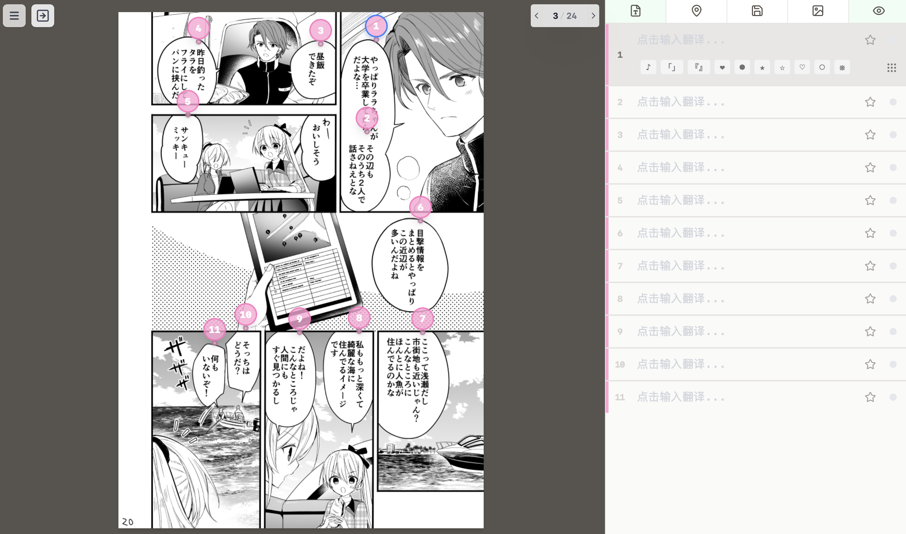

# 白杨子 N · PopRaKo Native

基于白杨子生态系统的离线漫画翻校器客户端。

## 应用下载

支持平台：macOS 15+、Windows 11+。

- [GitHub Releases](https://github.com/poprako-dev/poprako-native/releases)

## 界面预览

### 项目列表

### 项目详情

### 翻校工作台

## 主要功能

- **离线翻校**：在本机管理漫画图片与翻校内容，通过项目列表继续上次的工作。
- **页面管理**：从图片文件夹创建项目，添加、重排或替换页面图片。
- **定位翻译**：在图片上添加位置标记，区分框内、框外文本，按顺序整理译文。
- **独立校对**：分别保留译文与校对稿，查看文本差异、确认校对，并标记需要后续关注的内容。
- **编辑辅助**：支持搜索替换、自定义快捷键和常用特殊字符，提供手动保存与停止编辑后的自动保存。
- **文件交接**：导入 PRK、LabelPlus 译文及项目包；导出包含两种译文的 ZIP，也可附带全部图片，在另一台电脑继续翻校。

## 问题反馈

遇到问题或有功能建议，欢迎通过 [GitHub Issues](https://github.com/poprako-dev/poprako-native/issues) 反馈。

报告问题时，请附上应用版本、操作系统、具体操作步骤和实际结果；如果方便，也可以提供截图或用于复现的示例文件。提交前可以先搜索已有反馈，看看是否有相同的问题。

## 代码贡献

欢迎通过 Pull Request 参与改进。

开始前请阅读[工程规范](docs/REQUIREMENTS.md)和[领域术语](CONTEXT.md)，功能边界见[模型说明](docs/MODEL.md)。

## 致谢

感谢以下开源项目及其贡献者：

- [React](https://react.dev/)
- [Lucide](https://lucide.dev/)
- [Tauri](https://tauri.app/)
- [Tailwind CSS](https://tailwindcss.com/)

## 许可证

本项目采用 [GNU Affero General Public License v3.0 或更新版本（AGPL-3.0-or-later）](LICENSE) 许可证。
